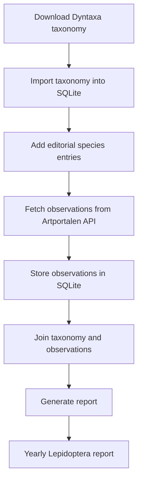

# Yearly Lepidoptera Report – Scania


Open‑source tooling for generating the **Yearly Lepidoptera report for Scania (Skåne), Sweden** using
data from **Artportalen / SLU Artdatabanken**.

The project provides a reproducible pipeline that:

1. downloads the latest **Dyntaxa taxonomy**
2. fetches **Lepidoptera observations from Artportalen**
3. stores all data locally in **SQLite**
4. generates a structured **yearly Lepidoptera report**

The entire report can be rebuilt from raw data at any time.

---

# License

This software is released under the **MIT License**.

The software uses data provided by **SLU Artdatabanken APIs**, including:

- Artportalen (Species Observation System)
- Dyntaxa taxonomy

Use of these APIs is subject to their terms and conditions:

https://www.slu.se/artdatabanken/rapportering-och-fynd/oppna-data-och-apier/om-slu-artdatabankens-apier

Users of this repository are responsible for complying with the API license terms.

---

# Purpose

The purpose of this project is to generate the **annual Lepidoptera report for Scania** in a fully
transparent and reproducible way.

The pipeline combines:

- taxonomy from **Dyntaxa**
- observation data from **Artportalen**
- manual editorial additions
- SQL views to generate the final report

All data is stored in a local **SQLite database**.

---

# Pipeline overview



The pipeline is orchestrated by:

```
scripts/run_pipeline.sh
```

---

# Project structure

```
config/
    common.env
    settings.env.template

scripts/
    run_pipeline.sh
    update_taxonomy.sh
    generate_report.sh

src/
    init_sqlite_db.py
    import_dyntaxa_dwca.py
    sync_sos_sqlite.py

sql/
    schema.sql
    editorial_report.sql
    new_spec_sk_YEAR.sql

dwca/
    downloaded taxonomy files

db/
    obsperyear.sqlite

logs/
    pipeline logs

output/
    generated reports
```

---

# Installation

Requirements

- Python 3
- SQLite3
- curl
- unzip
- bash
- git

Clone the repository

```
git clone <repository>
cd sk_lepi_yearly
```

Create configuration

```
cp config/settings.env.template config/settings.env
```

Add your API key

```
SOS_API_KEY=<your key>
```

Load configuration

```
source config/common.env
```

---

# Running the pipeline

Run the complete workflow:

```
scripts/run_pipeline.sh
```

The pipeline performs:

1. download taxonomy
2. initialize database
3. apply database configuration
4. add yearly species
5. import taxonomy
6. download observations
7. generate report

Example output:

```
output/report_YYYYMMDD_HHMMSS.txt
```

Logs are written to:

```
logs/pipeline_TIMESTAMP.log
```

---

# Regenerate report only

If the database already exists you can regenerate the report without re-running the full pipeline.

```
scripts/generate_report.sh
```

---

# Update taxonomy only

```
scripts/update_taxonomy.sh
```

This downloads the latest Dyntaxa Darwin Core archive.

---

# Reset database

To rebuild everything:

```
rm db/obsperyear.sqlite
python src/init_sqlite_db.py
```

---

# Configuration

Configuration is controlled through:

```
config/common.env
```

Example settings

```
SOS_YEAR=2025
SOS_PROVINCE_FEATURE_ID=1
SOS_DATA_PROVIDER_ID=1
```

---

# Database configuration

Some parameters are stored inside SQLite.

Example parameters

| Key | Description |
|----|----|
| report_year | report year |
| report_formatted | enable markdown formatting |

View configuration

```
SELECT * FROM v_config_status;
```

---

# Data sources

## Dyntaxa taxonomy

Imported from a Darwin Core archive downloaded from the Dyntaxa API.

Imported by

```
src/import_dyntaxa_dwca.py
```

## Artportalen observations

Observation data is downloaded from the **Species Observation System API**.

The script:

```
src/sync_sos_sqlite.py
```

downloads observations month-by-month to respect API limits.

---

# Output

The final report is generated using SQL views that combine

- taxonomy
- observations
- editorial notes

Output structure

- Macro Lepidoptera
- Micro Lepidoptera
- family
- species

The report is suitable for export to Word or LibraOffice

```
pandoc -f markdown+hard_line_breaks report_YYYYMMDD_HHMMSS.txt -o report.docx
```

---

# Acknowledgements

Data and APIs provided by

**SLU Artdatabanken**

including

- Artportalen
- Species Observation System
- Dyntaxa taxonomy
